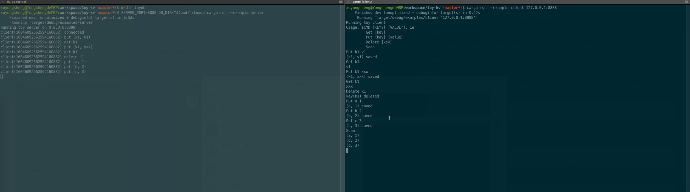

# Toy-KV

A single node kv server using key-value separations strategy instead of LSM-based technology.

PS: Do not use this in any production environment.

## Features

- SSD Friendly(No huge write amplification)
- Data Persistence
- Easy to Integrate (you can change the transport layer easily)

## Usage

Toy-kv provides a store class that supports `Get`, `Put`, `Delete` and `Scan` operations.

It is suggested start with a simple C/S demo.

### Server

Direct IO may only support in Linux based OS, so using docker to start a server. (It also works on OSX Mojave, but no guarantee)

> mkdir -p ./toydb
> 
> docker run -it -e SERVER_PORT=8888 -e DB_DIR=/toydb -p 8888:8888 chux0519/toy_server

Above will start a local kv server at port 8888.

Also, you can run following on your local machine.

> mkdir -p ./toydb
>
> SERVER_PORT=8888 DB_DIR="$(pwd)"/toydb cargo run --example server

### Client

> git clone https://github.com/chux0519/toy-kv && cd toy-kv
>
> cargo run --example client 127.0.0.1:8888

Now, play with the client.

## Design

Store kv pair with three separate files: keys, values, and buffer.
So `Store` has three components: `Keys`, `Values` and `Buffer` (When running a store instance, it also build the `Index` of `Values` from `Keys`).

### Keys

The keys file ends with `.k`

Each keys file may contain several sections, and each section includes 65536 records, each record is in the format: `[8bytes][4bytes]`. The front part of a record is for the key, and the second half stores the position of relevant value.

When creating a `Store`, it read the `.k` file, and build the index for all values. Then the last section of keys will be mapped to memory(mmap).

### Values

The values file ends with `.v`

Values files' format is similar to the `.k` files, it contains several sections, and each section contains 65536 records, unlike keys file, each record of values file is entirely for value(256 bytes).

A Store instance only holds the file handle of the `.v` file(opening with O_DIRECT flag), so it uses direct io rather than other buffer io methods.

### Buffer

Ends with `.b`, its size is fixed at 16mb (the same as each section of values).
When the store does `Put` action, it first write data to the buffer, when the buffer is full, then it will flush to values ​​file using direct io.

## Limitation

- Single thread usage
- Only support  fixed length kv pair, (8 bytes, 256 bytes)
- Only support at most 0xffffffff(1<<32) kv pairs (using 4 bytes to index value)

## TODOS

- [ ] More reasonable benchmark (YCSB support maybe)
- [ ] Multi-thread usage and multi-shard storage
- [ ] Garbage collection